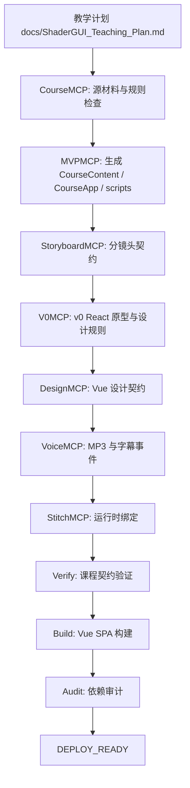

# ShaderGUI_Learning_v1.0 Skill 链 DAG 设计

本文描述本工程从教学计划到 Vue 课程播放器的生产 DAG。DAG 的目标是让课程内容、分镜头、音频、字幕、设计契约、探索页、做题页和验证脚本形成可重复执行的闭环。

## 对齐约束（必读）

- [AGENT_SINGLE_SOURCE] `.agent` 是唯一可信源；Cursor/Codex/其它平台只能作为执行器，禁止使用 `.cursor`/`.workbuddy` 作为规则/资产来源。
- [MVP_EXECUTION_CONTRACT] 执行 MVP 必须遵循 `docs/MVP_Execution_Contract.md` 和 `.agent/mvp-execution-scope.json`；禁止清理 `.agent`、`node_modules` 等禁区。
- [NO_INTERNAL_GUIDANCE_UI] 前端学习页面不得展示内部生产指导：`shotInstruction`、`focusInstruction`、`implementationHint`、`learnerTakeaway`、`Now focusing` 一律禁止展示。
- [TOKEN_LEVEL_ANIMATION] 代码类页面动效必须细化到代码字段/token，例如 `ShaderGUI`、`OnGUI`、`CustomEditor`、`FindProperty`、`ShaderProperty`；不得退化为整卡片或整块代码动画。
- [COURSE_HOME_ALIGNMENT_GRID] 首页和模块入口必须使用统一单层菜单。
- [SYNC_RULES_DAG_VERIFY] 任何影响规则/DAG/验收标准的改动必须同步更新 `docs/Skill_Chain_DAG.md`、`.agent/rules.md`、`.agent/SKILL.md` 和 `scripts/verify_course.py`。
- [REVERIFY_BUILD_BROWSER] 需循环自检直至交付：`verify_course.py`、`npm run build` 和必要的浏览器验证。
- [COMPLETION_GATE_FILE_DRIVEN] 任务完成必须以仓库文件、handoff、memory 和验证结果为准。

## DAG 总览



## MVP Scope

当前 MVP scope 由 `.agent/mvp-scope.json` 控制：

- 正式课时：`p00`、`p01`。
- 探索页：`p01` 的子页面 `/module/Module_01/slide/p01/explore`。
- 做题页：`/module/Module_01/quiz`。

探索页不是 `pXX`，不计入 `slideCount`，不得作为 `kind=interactive` slide 出现在 `slides.json`。

## 节点职责

| 节点 | 输入 | 输出 | 验收 |
| :--- | :--- | :--- | :--- |
| `CourseMCP` | docs、`.agent` 规则 | 源材料检查结果 | 必须确认 `.agent` 单一可信源 |
| `MVPMCP` | `CourseContent/<module>`、scope、templates | Vue SPA、数据、脚本 | 只生成 scope 内产物 |
| `StoryboardMCP` | slides、subtitles、explorations、quizzes | `storyboard-contract.json` | motion cues 与交互屏完整 |
| `V0MCP` | storyboard | `.agent/v0/<module>/react-prototype.json` | v0 引用落到 `.agent/v0/` |
| `DesignMCP` | storyboard、v0 handoff | `design-contract.json` | 设计契约承接 storyboard 与 v0 |
| `VoiceMCP` | transcripts | MP3、subtitle JSON | 音频不是占位音 |
| `StitchMCP` | slides、audio、subtitles、storyboard、design | `stitch-manifest.json` | 课程页、探索页、做题页绑定完整 |
| `verify_course.py` | 全部产物 | 验证报告 | 失败即阻断 |
| `BuildMCP` | CourseApp | `dist/` | `npm run build` 通过 |
| `AuditMCP` | npm 依赖 | audit 结果 | 无 P0/P1 漏洞 |

## Skill Registry

方案技能库由 `.agent/skills/` 维护：

- `web-interactive-content-builder`：顶层总控 Skill。
- `skill-router`：根据内容特征选择或组合子 Skill。
- `interactive-article-skill`：长文交互解释。
- `explorable-mini-skill`：短篇可探索解释器。
- `parameter-playground-skill`：参数沙盒。
- `creative-workbench-skill`：任务工作台。
- `animated-lesson-skill`：动画课件。
- `chapter-lab-skill`：章节实验课程。

ShaderGUI 当前默认组合为 `chapter-lab-skill + explorable-mini-skill`。

## Interaction Necessity Gate

探索页必须先通过必要性闸门。只有满足以下条件时才允许插入：

- 静态讲解和做题页不足以达成学习目标。
- 存在可操纵的概念变量。
- 用户操作能产生即时反馈。
- 交互结果可以帮助迁移到真实 ShaderGUI 工程判断。
- 探索页不破坏主课程序列。

闸门产物应写入 `.agent/interactive-content/<module>/<slide>/explore/necessity-gate.json` 或同等 `.agent` 契约。

## 运行时契约

- `CoursePlayer.vue` 必须读取 `storyboard-contract.json` 并向 `SlideCanvas.vue` 传入 `activeCue`、`visualComposition`、`motionCues`。
- `SlideCanvas.vue` 必须按 cue 高亮知识点和代码 token。
- `SlideNav.vue` 必须提供播放、暂停、进度条、上一页、下一页、探索入口、模块入口。
- `ExploreView.vue` 必须作为父课时子路由。
- `QuizView.vue` 必须只展示当前题卡，完成后展示成绩页。

## UTF-8 Contract

所有文本产物必须是 UTF-8，包括：

- `.agent` 规则、Skill、MCP、memory、handoff、reports、templates。
- `CourseContent` 源数据与逐字稿。
- `CourseApp/src/data` 契约数据。
- `docs` 文档。
- `scripts` 脚本。

任何乱码、mojibake 或非 UTF-8 文本都是交付阻塞项。

## 平台违规闸门

`platform_violation_guard.py` 在 `flow_engine.py` 入口前扫描 `.cursor/` 和 `.workbuddy/`。发现平台私有 AI 资产时：

- DAG fail-fast。
- 报告写入 `.agent/reports/cleanup/LATEST_PLATFORM_VIOLATION.md`。
- 机器报告写入 `.agent/reports/cleanup/LATEST_PLATFORM_VIOLATION.json`。
- 可执行 `python .agent/platform_violation_guard.py --basedir . --fix` 隔离违规文件。

## 验证闭环

最小验证：

```powershell
python scripts\verify_course.py
npm --prefix CourseApp run build
```

触及前端体验时还必须验证：

- `/`
- `/module/Module_01/slide/p00`
- `/module/Module_01/slide/p01`
- `/module/Module_01/slide/p01/explore`
- `/module/Module_01/quiz`
- `/audio/Module_01/p00.mp3`
- `/audio/Module_01/p01.mp3`

## 反馈同步规则

每次用户反馈后必须判断是否影响 DAG。影响时同步更新：

- `docs/Skill_Chain_DAG.md`
- `.agent/rules.md`
- `.agent/SKILL.md`
- `scripts/verify_course.py`
- 相关 `.agent/mcp_servers/` 或 templates
- `.agent/memory/`
- `.agent/handoff/`

不影响 DAG 时也要记录判断理由。

## Small Fix Ownership

小而确定、低风险的一致性问题由当前执行方直接修复，不得要求用户手动处理。包括路径不一致、编码问题、handoff/memory/STATE 漏写、验证脚本漂移和明显笔误。
